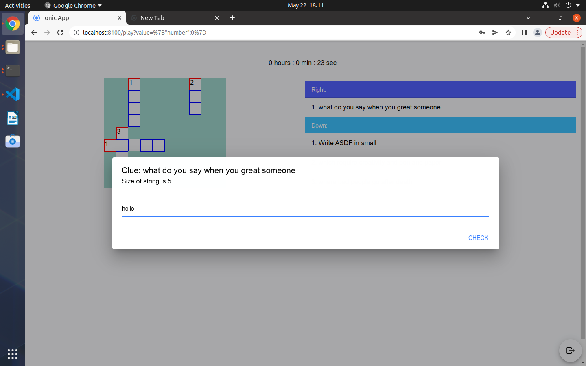

# Cross Word Puzzle
I have developed a crossword puzzle as a web-based application using the IONIC framework. It has the potential to be converted into Android and iOS applications. The puzzle application consists of two distinct user roles: admin and user. The admin role allows users to create and modify puzzles, while the user role is solely focused on playing the puzzles and keeping track of their solving time.

### Technology Stack
    - Angular
    - TypeScript
    - Ionic 

## Admin UI

## user UI

